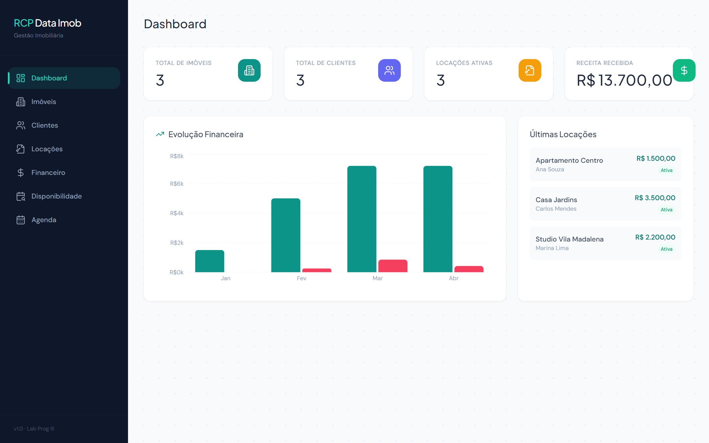
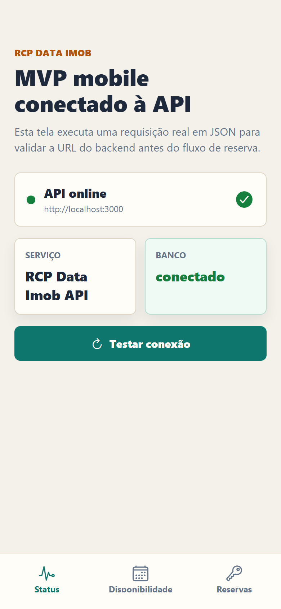
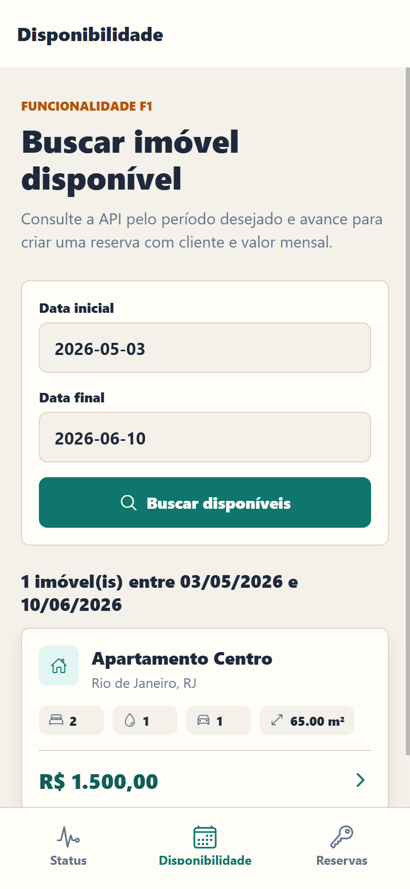
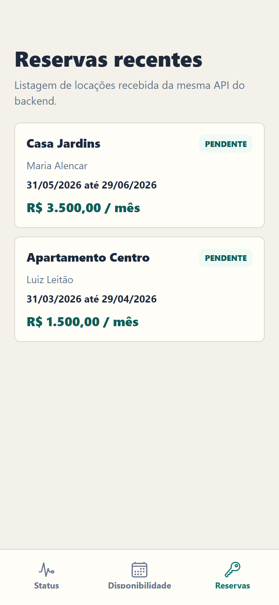
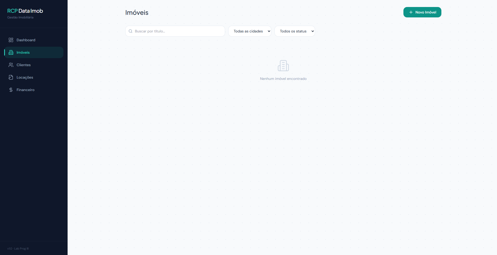
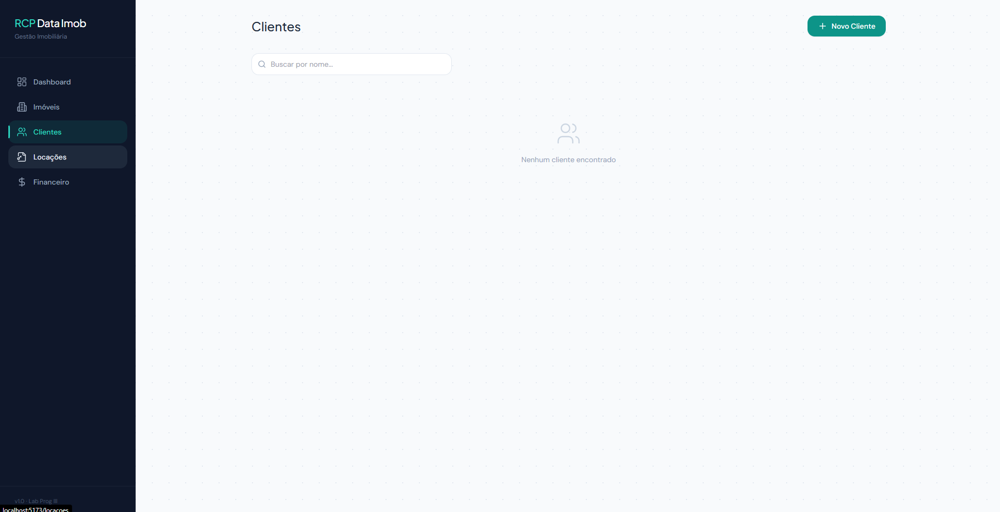
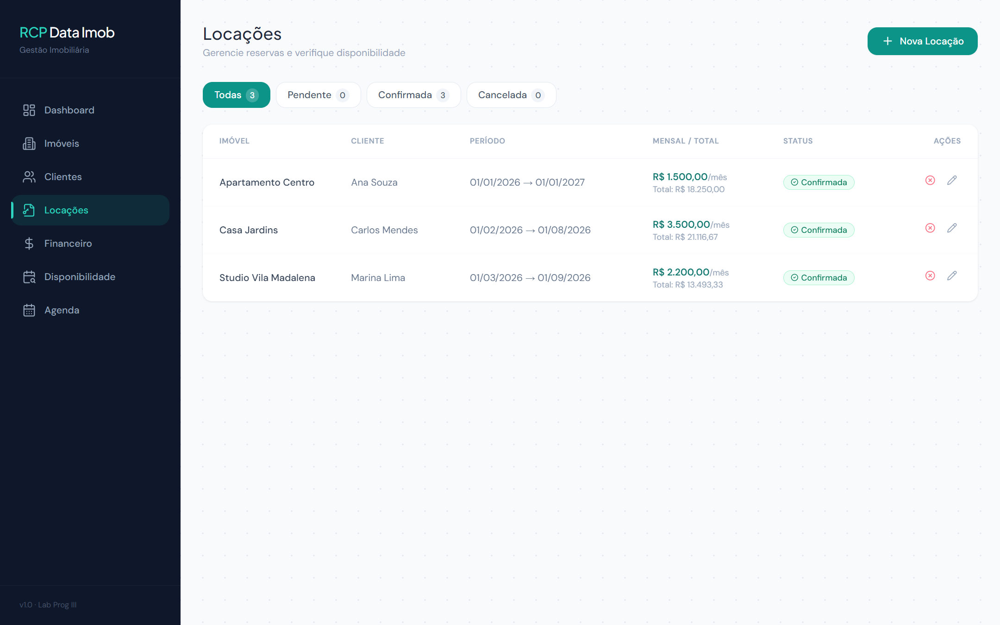
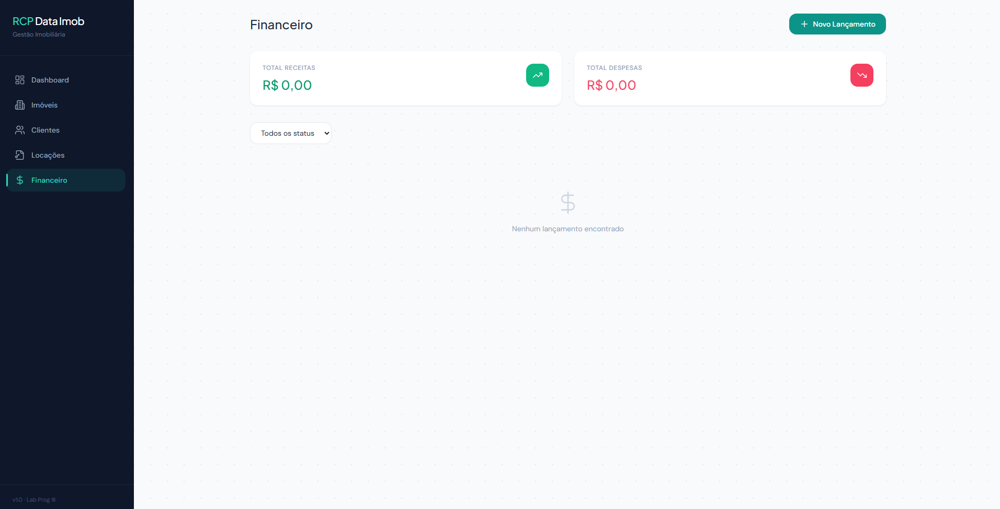

# RCP Data Imob

**Grupo:** Rafael Carvalheira, Marcell Parra, Ruan Pablo
**Disciplina:** Laboratório de Programação 3 — Prof. Matheus Vanzan

Plataforma de gestão de locações de imóveis, composta por três serviços orquestrados via Docker Compose.



---

## Serviços e Portas

| Serviço  | Tecnologia             | Porta (host → container) |
|----------|------------------------|--------------------------|
| db       | PostgreSQL 13 (Alpine) | 8039 → 5432  |
| backend  | Node.js 18 / Express   | 8031 → 3000  |
| frontend | React 18 / Vite 6      | 8032 → 5173  |
| mobile   | Expo / React Native    | 19000+ (Expo)            |

---

## Como Subir o Ambiente

```bash
# Build e start de todos os serviços
docker compose up --build -d

# Verificar status dos containers
docker compose ps

# Parar os serviços
docker compose down

# Remover volumes (apaga dados do banco)
docker compose down -v
```

Após subir, acesse:

| Serviço  | URL                          |
|----------|------------------------------|
| Frontend | http://localhost:8032        |
| API REST | http://localhost:8031        |
| Healthcheck | http://localhost:8031/status |

O banco já sobe **populado automaticamente** (via `database/init.sql`) — não há etapa manual de carga de dados.

---

## Entregável 8 — MVP Mobile

O MVP mobile foi criado em [`mobile/`](mobile/) com **React Native + Expo** e consome a mesma API REST do backend.

### Funcionalidade implementada

Foi escolhida a **F1 — Busca de Disponibilidade e Criação de Reserva**, conforme definido na documentação do projeto. O app mobile possui:

| Tela | Recurso |
|------|---------|
| Status | Testa `GET /status` e exibe JSON real da API/banco |
| Disponibilidade | Busca imóveis disponíveis via `GET /imoveis/disponibilidade?data_inicio=&data_fim=` |
| Detalhes do imóvel | Mostra dados do imóvel, período consultado, categorias e valor |
| Confirmar reserva | Carrega clientes via `GET /clientes` e cria reserva via `POST /locacoes` |
| Reservas | Lista locações existentes via `GET /locacoes` |

### Configurar URL da API

No emulador Android, o app usa por padrão:

```bash
http://10.0.2.2:3000
```

Em celular físico na mesma rede local, informe o IP do computador:

```bash
cd mobile
copy .env.example .env
# edite .env:
# EXPO_PUBLIC_API_URL=http://SEU_IP_LOCAL:3000
```

### Executar tudo com um comando

Na **raiz do projeto**, um único comando sobe o banco + backend + frontend (Docker) e inicia o app mobile (Expo):

```bash
npm run dev
```

Esse comando:
1. Detecta o IP da máquina na rede local e grava `mobile/.env` apontando para `http://SEU_IP:3000` (via `scripts/dev-setup.js`) — assim o app já funciona em **celular físico** pelo Expo Go.
2. Sobe os containers com `docker compose up --build -d` (o backend é exposto tanto na `8031` quanto na `3000`).
3. Roda `npm install` e `npm start` dentro de `mobile/`, abrindo o Expo Dev Server (QR Code).

Depois é só abrir pelo **Expo Go** (escaneando o QR, com o celular na mesma rede Wi-Fi) ou pelo **emulador Android/iOS**.

> Scripts auxiliares (raiz): `npm run up` (só Docker), `npm run mobile` (só Expo), `npm run logs`, `npm run stop`, `npm run reset` (apaga o banco).

### Executar manualmente (passo a passo)

```bash
# terminal 1: backend + banco
docker compose up --build -d

# terminal 2: app mobile
cd mobile
npm install
npm start
```

Depois, abra pelo Expo Go ou emulador Android/iOS.

### Capturas do MVP mobile

| Status API | Disponibilidade | Reservas |
|------------|-----------------|----------|
|  |  |  |

> **Atualizando de uma versão anterior?** Aplique as migrations sem perder dados:
> ```bash
> docker exec -i labprogiii-db-1 psql -U admin -d rcp_data_imob < migration_f2.sql
> docker exec -i labprogiii-db-1 psql -U admin -d rcp_data_imob < migration_f3.sql
> ```
> Em uma instalação limpa (`docker compose down -v` antes de subir), as migrations não são necessárias — `database/init.sql` já cria o schema base e a F3 só adiciona uma coluna opcional + índices.

---

## Telas do Frontend

| Rota          | Tela        | Descrição                                                          |
|---------------|-------------|--------------------------------------------------------------------|
| `/`           | Dashboard   | KPIs (imóveis, clientes, locações ativas, receita), gráfico financeiro, últimas locações |
| `/imoveis`    | Imóveis     | Cards com filtros por cidade/status/busca, CRUD completo via modal |
| `/clientes`   | Clientes    | Tabela com busca por nome, CRUD completo via modal                 |
| `/locacoes`   | Locações    | Tabela com selects de imóvel/cliente, encerramento de locação      |
| `/financeiro` | Financeiro  | **F3** — 4 KPIs analíticos, gráfico donut por status, filtros expandidos, CRUD completo (criar/editar/excluir/pagar) |

<details>
<summary>Screenshots das telas</summary>

**Imóveis**


**Clientes**


**Locações**


**Financeiro**


</details>

---

## Stack Tecnológica

**Backend:** Node.js, Express 4.18, PostgreSQL 13, pg 8.11
**Frontend:** React 18, Vite 6, React Router DOM 7, Tailwind CSS 3.4, Recharts 2.12, Lucide React, Axios
**Infra:** Docker, Docker Compose

---

## API REST — Endpoints

Base URL: `http://localhost:8031`

Todos os endpoints retornam e aceitam **JSON**.

### Status

| Método | Endpoint  | Descrição                                |
|--------|-----------|------------------------------------------|
| GET    | /status   | Verifica se a API e o banco estão ativos |

**Exemplo de resposta `GET /status`:**
```json
{
  "status": "ok",
  "servico": "RCP Data Imob API",
  "versao": "1.0.0",
  "banco": "conectado",
  "timestamp": "2026-03-08T20:00:00.000Z"
}
```

---

### Imóveis

| Método | Endpoint       | Descrição                |
|--------|----------------|--------------------------|
| GET    | /imoveis       | Listar todos os imóveis  |
| GET    | /imoveis/:id   | Buscar imóvel por ID     |
| POST   | /imoveis       | Cadastrar novo imóvel    |
| PUT    | /imoveis/:id   | Atualizar imóvel         |
| DELETE | /imoveis/:id   | Remover imóvel           |

**Campos do imóvel (POST/PUT):**
```json
{
  "titulo": "Apartamento Centro",
  "descricao": "Apto 2 quartos, reformado",
  "endereco": "Rua das Flores, 100",
  "cidade": "São Paulo",
  "estado": "SP",
  "cep": "01000-000",
  "valor_aluguel": 1500.00,
  "valor_venda": 250000.00,
  "area": 65.0,
  "quartos": 2,
  "banheiros": 1,
  "vagas_garagem": 1
}
```

---

### Clientes

| Método | Endpoint       | Descrição                |
|--------|----------------|--------------------------|
| GET    | /clientes      | Listar todos os clientes |
| GET    | /clientes/:id  | Buscar cliente por ID    |
| POST   | /clientes      | Cadastrar novo cliente   |
| PUT    | /clientes/:id  | Atualizar cliente        |
| DELETE | /clientes/:id  | Remover cliente          |

**Campos do cliente (POST/PUT):**
```json
{
  "nome": "Ana Souza",
  "cpf": "123.456.789-00",
  "email": "ana@email.com",
  "telefone": "(11) 99999-9999",
  "endereco": "Rua A, 10"
}
```

---

### Locações

| Método | Endpoint                  | Descrição                  |
|--------|---------------------------|----------------------------|
| GET    | /locacoes                 | Listar todas as locações   |
| GET    | /locacoes/:id             | Buscar locação por ID      |
| POST   | /locacoes                 | Registrar nova locação     |
| PATCH  | /locacoes/:id/encerrar    | Encerrar locação ativa     |

**Campos da locação (POST):**
```json
{
  "imovel_id": 1,
  "cliente_id": 1,
  "data_inicio": "2026-03-01",
  "data_fim": "2027-03-01",
  "valor_mensal": 1500.00
}
```

---

### Categorias de Imóveis

| Método | Endpoint         | Descrição                |
|--------|------------------|--------------------------|
| GET    | /categorias      | Listar todas as categorias |
| POST   | /categorias      | Criar nova categoria     |
| DELETE | /categorias/:id  | Remover categoria        |

**Campos da categoria (POST):**
```json
{
  "nome": "Apartamento",
  "descricao": "Imóvel em condomínio vertical"
}
```

---

### Financeiro (atualizado pela F3)

| Método | Endpoint                     | Descrição                                                                       |
|--------|------------------------------|---------------------------------------------------------------------------------|
| GET    | /financeiro                  | Lista lançamentos com filtros: `?tipo=&status=&locacao_id=&data_inicio=&data_fim=` |
| GET    | /financeiro/resumo           | KPIs analíticos: receitas, despesas, saldo, pendentes, atrasados (F3)            |
| GET    | /financeiro/por-mes?meses=6  | Série temporal mês a mês para gráficos (F3)                                       |
| GET    | /financeiro/:id              | Detalhe de um lançamento por ID (F3)                                              |
| POST   | /financeiro                  | Registra lançamento (aceita campo `descricao`)                                    |
| PUT    | /financeiro/:id              | Edição completa do lançamento (F3)                                                |
| PATCH  | /financeiro/:id/pagar        | Marca como pago e grava `data_pagamento`                                          |
| DELETE | /financeiro/:id              | Remove o lançamento (F3)                                                          |

**Campos do registro financeiro (POST):**
```json
{
  "locacao_id": 1,
  "tipo": "receita",
  "valor": 1500.00,
  "data_vencimento": "2026-04-05",
  "descricao": "Aluguel abril/2026"
}
```

**Exemplo de resposta `GET /financeiro/resumo`:**
```json
{
  "total_receitas": 18000.00,
  "total_despesas": 4500.00,
  "saldo": 13500.00,
  "total_pendente": 3000.00,
  "total_atrasado": 1500.00,
  "qtd_pendente": 2,
  "qtd_atrasado": 1,
  "qtd_pago": 6,
  "qtd_total": 9
}
```

---

## Estrutura do Projeto

```
.
├── docker-compose.yml
├── database/
│   └── init.sql
├── backend/
│   ├── Dockerfile
│   ├── package.json
│   └── src/
│       ├── index.js
│       ├── db/pool.js
│       └── routes/
│           ├── status.js
│           ├── imoveis.js
│           ├── clientes.js
│           ├── locacoes.js
│           ├── categorias.js
│           └── financeiro.js
├── frontend/
│   ├── Dockerfile
│   ├── .dockerignore
│   ├── package.json
│   ├── vite.config.js
│   ├── tailwind.config.js
│   ├── postcss.config.js
│   ├── index.html
│   └── src/
│       ├── main.jsx
│       ├── App.jsx
│       ├── index.css
│       ├── api/axios.js
│       ├── components/
│       │   ├── Layout.jsx
│       │   ├── Modal.jsx
│       │   ├── StatusBadge.jsx
│       │   ├── Skeleton.jsx
│       │   └── EmptyState.jsx
│       └── pages/
│           ├── Dashboard.jsx
│           ├── Imoveis.jsx
│           ├── Clientes.jsx
│           ├── Locacoes.jsx
│           ├── Financeiro.jsx
│           ├── Disponibilidade.jsx
│           └── Calendario.jsx
├── postman/
│   └── RCP_Data_Imob.postman_collection.json
└── docs/
    ├── main.tex                        # fonte LaTeX da documentação consolidada
    ├── RCP_Data_Imob_Documentacao.pdf  # documentação compilada
    └── screenshots/
```

---

## Documentação

A documentação completa do projeto (todos os entregáveis unificados) está em [`docs/RCP_Data_Imob_Documentacao.pdf`](docs/RCP_Data_Imob_Documentacao.pdf), gerada a partir da fonte LaTeX [`docs/main.tex`](docs/main.tex).
